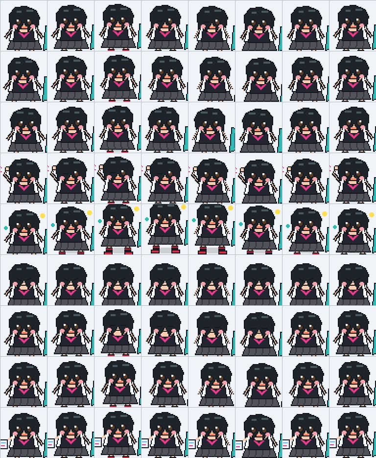

# Peni Parker Pet

A custom animated pet package for ChatGPT/Codex Pets. The character is rendered in an original comic-print style: short black hair, a lively anime expression, a school-uniform-inspired outfit, a teal cat backpack, CMYK halftones, and hand-inked comic lines.



## Install

1. Download or clone this repository.
2. Keep `pet.json` and `spritesheet.webp` together in the same `peni-parker` folder.
3. Copy the `peni-parker` folder into your Codex pets directory:

   ```text
   ~/.codex/pets/peni-parker
   ```

   On Windows, the usual location is:

   ```text
   C:\\Users\\<your-user>\\.codex\\pets\\peni-parker
   ```

4. Restart Codex or refresh the pets list. The pet will appear as **Peni Parker**.

## Package Contents

| File | Purpose |
| --- | --- |
| `pet.json` | Pet identity, display name, description, atlas version, and sprite path. |
| `spritesheet.webp` | The transparent animated sprite atlas used by Codex. |
| `preview.jpg` | A static image for repository previews. It is not required at runtime. |

## Sprite Atlas

The package uses the v2 pet format (`spriteVersionNumber: 2`). The atlas is a transparent WebP image with these fixed dimensions:

| Property | Value |
| --- | --- |
| Atlas size | 1536 x 2288 px |
| Grid | 8 columns x 11 rows |
| Frame size | 192 x 208 px |
| Animation frames | 88 |

Rows 0 through 8 provide the standard Codex animation states:

| Row | State | Purpose |
| --- | --- | --- |
| 0 | `idle` | Calm presence while no task is active. |
| 1 | `running-right` | Directional movement toward screen-right. |
| 2 | `running-left` | Directional movement toward screen-left. |
| 3 | `waving` | Greeting gesture. |
| 4 | `jumping` | Vertical reaction. |
| 5 | `failed` | Error or unsuccessful-task reaction. |
| 6 | `waiting` | Waiting for input or approval. |
| 7 | `running` | Focused working or processing state. |
| 8 | `review` | Focused review state. |

Rows 9 and 10 contain 16 look-direction poses in clockwise order. Together they cover every 22.5-degree step: up, up-right, right, down-right, down, down-left, left, and up-left, including the intermediate angles.

## Customization Notes

The pet ID is `peni-parker`, and the display name is defined in `pet.json`. If you rename the directory, keep `pet.json` and `spritesheet.webp` together and do not change the atlas dimensions or grid layout. Changing the image without preserving the 8 x 11 grid and 192 x 208 frame size will prevent correct animation playback.

## Compatibility

This package targets the Codex Pets v2 sprite format. It requires a Codex/ChatGPT environment that supports `spriteVersionNumber: 2` and WebP spritesheets.

## Attribution

This is an unofficial fan-made pet package and is not affiliated with, endorsed by, or sponsored by Marvel, Sony, or the owners of the Peni Parker character. Peni Parker and related character names are the property of their respective owners.
